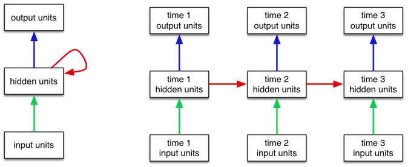
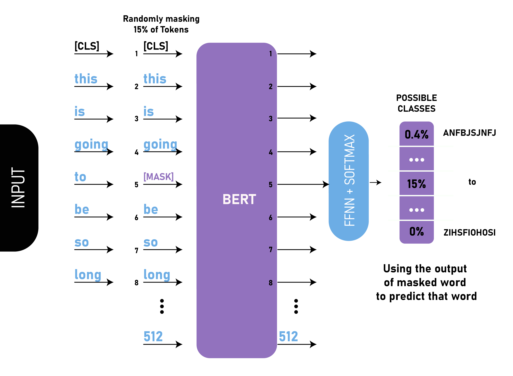
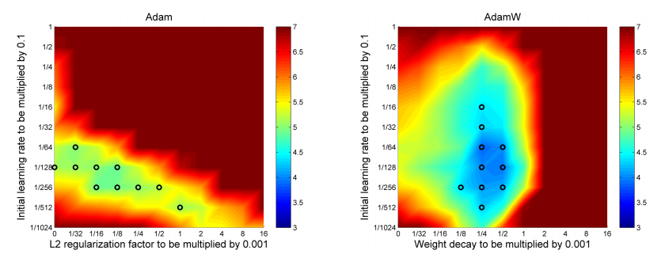

# AI Generated Review Detection in Book Reviews

## Abstract

Online market stability is predicated upon consumer trust. Most online platforms provide an open and semi-anonymous platform for posting reviews for a wide range of products. Due to the open and anonymous nature of these platforms, they're vulnerable to reviews being faked, and the most efficient way to do this is to generate reviews using one of the many advanced Natural Language Processing (NLP) pre-trained models. These models are generally offered as free and open-source research projects that utilize advanced research into language processing and semantic understanding. We have developed a Machine Learning product that utilizes, in some cases, the same technology that these blackhat users work with in order to detect these AI-generated fake reviews.

We have utilized transfer learning techniques in order to design a robust detection system. Transfer learning is the simple act of storing knowledge gained solving one problem and applying it to another problem. We have achieved this by utilizing two cutting-edge NLP model architectures, OpenAI's GPT2, and Google AI's BERT. These models utilize an advanced Neural Network concept known as Transformer architecture which utilizes stacks of encoders and/or decoders to process text data in a way that can draw context from surrounding words in a sequence.

We leveraged GPT2's specialization in text generation and BERT's ability to classify text. Using a set of 50,000 Amazon book reviews sampled from 51 million reviews we were able to fine-tune GPT2 to generate book reviews. We were able to then use the real reviews combined with the fake reviews to generate a labeled dataset of 100,000 reviews on which to train our BERT classifier. We were able to design an architecture that would work when layered on BERT to allow for greater classification abilities. With this architecture combined with a base layer of `BERT` we were able to achieve an 80% success rate in detecting our AI-generated reviews.

## Workflow

The bulk of the work for this project is contained within the `Classifier_with_BERT.ipynb` notebook. Review generation is contained within the `Review_Generator_GPT2.ipynb`. Both notebooks contain insights for the particular models.

## Consumer Trust 

One of the most important consumer metrics for shopping in general, but even more so for online shopping, is almost immeasurable. 

Trust is an invaluable tool that wielded correctly can build a platform, product, or service to must-have status in our *have-it-now* society. The flip side of that coin is that a single viral video can destroy your brand or product overnight. These are both exciting and scary prospects for any business that is facing them. The entire world is peer-reviewed now and one of the ways that this is most obvious is through customer interaction via reviews. Customer reviews sell products. 

According to *Insider Intelligence*, a market leader in marketing and business insights: 

> In yet another sign that online reviews can make or break the path to purchase, June 2019 research from Trustpilot found that consumers would lose trust in a brand not only if they saw negative reviews—but also if the brand went one step further and deleted them.<br><br>
For a majority **(95.0%)** of the digital shoppers surveyed worldwide, that type of behavior played a big role in their distrust of a company, as did not have any reviews at all **(cited by 81.0%)**.<br><br>
**When asked what factors would lead to an increase in brand trust, three of the top 10 factors centered around reviews.** Nearly all respondents said positive customer reviews increased their trust in a brand, while 80.1% said they trusted companies that have a lot of customer reviews. Interestingly, if a company responded to negative customer comments, that would drive up trust for 79.9% of those surveyed.

*(emphasis added)*

<p align='center'>
    
    
</p>

<br><br>
As the pandemic has further transitioned our economy into an online and digital economy these consumer reviews hold even more weight. We can see the rapid growth of online shopping visits in just the first half of 2020 in this chart on Statista:

<p align='center'>
    
    
</p>


## The Issue with Online Reviews

Online reviews are one of the many forms of semi-anonymous means of communication that are available on the internet. As we've seen with the numbers provided by TrustPilot and Insider Intelligence **95%** of individuals are influenced by a positive online reputation and **93%** are influenced by positive reviews. The inverse is also true with **95%** of respondents being influenced by negative reviews or comments. This system and influence can be greatly abused by our advancing technology.

There is a dark side to the exponential advances in machine learning that we have seen in relation to things such as **Natural Language Processing (NLP)**. These techniques are being applied to the manipulation of customers. 

The [*Scientific American*](https://www.scientificamerican.com/article/could-ai-be-the-future-of-fake-news-and-product-reviews/) covered this in an article in late 2017:

> When Hillary Clinton’s new book What Happened debuted on Amazon’s Web site last month, the response was incredible. So incredible, that of the 1,600 reviews posted on the book’s Amazon page in just a few hours, the company soon deleted 900 it suspected of being bogus: written by people who said they loved or hated the book but had neither purchased nor likely even read it. Fake product reviews—prompted by payola or more nefarious motives—are nothing new, but they are set to become a bigger problem as tricksters find new ways of automating online misinformation campaigns launched to sway public opinion.

Consider that 3 years in tech development is exponential as our research advances at an incredible pace these fake review generations have become easier and easier. Generating fake reviews, once the domain of University research labs, is now available to anyone with enough technical acumen and seed money to rent GPU power. It has become easier and easier to cheat the system, and while the opposition technology increases at a similar rate edge cases will always fall through the cracks.

It isn't difficult to imagine a full pipeline of ML assisted tools that could be deployed from front to back to assist with anything from fake review generation to political Twitter bots. 

- Simple web-interaction scripts to create bogus accounts and email addresses.
- Use of open datasets to train cloud-based ML solutions through one of the widely available frameworks. 
    1. Allows for flexible maintenance
    2. Continual updates and improvement to maintain relevance
    3. Easy distribution
- Dashboard deployment for use of the product as a service (SaaS).

## The Solution

Fight fire with fire.

Push has come to shove in this end-user manipulation fight. We can use the same tools that the black-hat users leverage to beat them at their own game. Fortune 500s are using their resources to combat this issue, but the nefarious users abusing these review systems are more agile in most cases. Large-scale deployment and corporate-bureaucratic are slow processes that will always be behind the curve. It is important to employ a faster and more efficient method.

This efficient method is using one of the robust and pre-trained models to base the foundation of our fake detection bots. Making use of deeply researched and efficiently trained models will allow for a quicker turnaround and a more fine-tuned approach to modeling.

## Data

Initially, we attempted to utilize 51 million book reviews as provided by [Julian McAuley](http://cseweb.ucsd.edu/~jmcauley/datasets.html#google_local) in a single dataframe. Due to the nature of dataframes, being memory inefficient and unable to stream data, we had to engineer a work-around. After further research, we decided upon MongoDB. 

### MongoDB

MongoDB is a simple document-based database system that provides great flexibility in its expandability and extensibility. It does this by:

- Offering JSON-like document storage, meaning data structure can change document to document

- Easily map objects to application code

- Ad hoc queries, indexing, and real-time aggregation.

- Distributed at its core.

- Free to use under the (SSPLv1 license)

For our uses, we were able to load in a 51 million `20+gb` `JSON` file up as a database. We were then able to aggregate and further sample the data so that we could feed a selection of the reviews into our model for fine-tuning. 

Thus, in the end, we ended with a corpus of 50,000 reviews on which to train our `GPT2` model for review text generation. We chose not to push the number further due to a lack of computer resources. Were we working with a distributed network architecture we could've easily expanded the corpus size.

## PyTorch Dataloader

PyTorch has a Dataset inheritable class that can be used with the PyTorch framework. The Dataset inheritable class represents a Python iterable over a dataset that supports map-style or iterable-style datasets.

* Map-Style - Represents a map of Key-Value pairs to data samples within the dataset.
* Iterable-Style - Represents an iterable dataset like that which could be streamed from a database, remote server, or even generated in real-time.

## Tokenization

Computers do not natively understand words and that is an issue because a lot of the tasks we wish to automate involve processing language. There is a process that has been developed to change the text into a medium that computers can ingest.

**Tokenization** is the process by which words are converted to **tokens** that our models can process.

Tokens are one of a few things:
1. Words
2. Characters
3. Subwords

The most common way of separating tokens is by space, assuming that the strings being fed into the tokenizer are delimited by spaces.

Tokenization is the most important step in text preprocessing as it converts words into data that our models can take in. It does this by transforming the words, characters, or subwords into tokens and then these tokens are used to generate vocabularies. These vocabularies can then be used by our models to operate on text data. 

## Bidirectional Encoder Representations from Transformers (BERT)  Model

**Bidirectional Encoder Representations from Transformers (BERT)** was presented in a [white paper](https://arxiv.org/pdf/1810.04805.pdf) by **Google's AI Language** team in late 2018, and it caused an uproar in the **NLP** community for its wide variety of uses for everything from question answering to inference. As the name suggests its advancement is the bidirectional training of the Transformer architecture. 

Before the paper NLP training involved text paring left-to-right, or left-to-right and right-to-left training. The paper showed that a deeper context for language could be drawn from bidirectional transversal of sentences which allowed the model to draw deeper context and flow than a single direction model allowed. 

### Transformers
**BERT** is based on a novel mechanism named **Transformer Architecture**. Transformers are models that are at a very base level a set of **encoder cells** and **decoder cells** that use **context** from sequences to provide output sequences. An encoder takes in a sequence and compiles it into a vector called **context**. The context is then passed to the decoder and the decoder uses this context vector to produce a sequence token by token. These encoders and decoders tend to be **Recurrent Neural Networks**. 

<p align='center'>
    
</p>

[Image Courtesy](http://jalammar.github.io/illustrated-transformer/)

#### Recurrent Neural Networks
**Recurrent Neural Networks (RNN)** are a **directed graph** network that works on data through various temporal steps. A basic RNN takes *N* **input vectors** and will output *N* **output vectors** based on the input, and it does this operation by remembering context of the sequence and training based on past decisions. RNNs *remember* past decisions in **hidden state vectors** that influence the outputs of the network, and it does this to consider context of a sequence at a given time (temporal) step in the sequence. RNNs represents the ability for a past step to influence a future step and can increase the depth by adding additional hidden states or add additional nonlinear layers between inputs and hidden states.

<p align='center'>
    
</p>


##### Encoders, Decoders and Context
**Context** is a self-defined vector that is generated during token sequence encoding in a **sequence-to-sequence model**. It is the number of hidden units that are used by the encoder RNN. RNNs take two inputs at each step: the input sequence and the hidden state. These context vectors need to be generated somehow and that is through **word embeddings**. These **embeddings** generally turn words into vectors that capture the meaning and information of the words. These encodings are generated to be passed to the **decoder** in order for it to *'understand'* the context of the token sequence.

##### Attention Mechanism 
Though these context vectors provided context, it was supremely inefficient and therefore new mechanisms were developed to combat this but maintain the use of meaning and semantic information use in outputs. Several landmark papers introduced a method known as **Attention** which improved the efficiency of machine translation systems. 

A traditional sequence-to-sequence model only passes the end hidden state from the encoder to the decoder. An attention-based network work different from this:

**Encoder:**

An encoder in an attention-based network instead passes *all* of the hidden states of the encoding sequence. 


**Decoder:**

The decoder also does significantly more work. It receives all hidden states, and therefore the hidden states provide context for each token in the sequence instead of just the final state. Next, all hidden states are scored. Finally, each of the scores is softmaxed. **Softmax** takes a vector of *K-real numbers* and transforms them then sums them to one, thereby minimizing the low scoring states and maximizing the high scoring vectors.

**Self-Attention** 

Self-attention is another branch of the attention mechanism. It relates the position of tokens in a sequence in order to compute a representation of the same sequence. 

### BERT Mechanics

`BERT` not only builds upon several years of research as a foundation it also adds its own twist to the mix.

**Masked LM** 

 Before feeding token sequences into `BERT`, ~15% of words are replaced by a masking token (`[MASK]` by default). The model then attempts to predict the words that are masked based on the context provided by the other words in the sequence. This places a classification layer on the output of the transformer, which is then multiplied with the output vectors of the embedding matrix, and finally, the probability of likely words is predicted using a softmax.

**Next Sentence Prediciton** 

 `BERT` receives pairs of sentences as part of the training input. It can learn to predict if the second sentence is subsequent to the first sentence. The model is trained on half subsequent sentence pairs and half random pairs from the corpus thereby learning subsequent context between sentences. It is aided in this task by special tokens:
 
 * `[CLS]` which is inserted at the beginning of a sentence
 * `[SEP]` which is inserted at the end of each sentence.
 
### BERT Metrics 
 
1. Model size is important. `BERT_large` has 345 million parameters, which functions significantly better than `BERT_base` at 110 million parameters.

2. More training equates to more accuracy. The longer a model can fine-tune on the chosen corpus, the more accurate it becomes.

3. `BERT` converges slower than the sequence-to-sequence model since there are several extra layers stacked on top of the transformer architecture, but it outperforms other models at similar numbers of training steps.

<p align='center'>
    
</p>

## Model Architecture

Using transfer learning is the heart of our model. The `BERT` model is already trained with 110 million parameters. It is very important that we do not train the base model further, so we freeze the parameters of our base model by disallowing gradient calculations.

We inherit from the PyTorch `nn` module so that we can start building our neural network. In our `__init__` all we are taking in is our `BERT` model that was instantiated earlier. After our `BERT` model is in-place we follow that by passing the outputs from the pre-trained model into our `LSTM` layer. Our inputs are then passed through a series of `fully connected layer`, with all layers after the `LSTM` layer are separated with a `batchnorm` layer. Our inputs are then softmaxed to return a vector with lower values minimized and larger values maximized on a 0-to-1 scale.

### LSTM

>The Long Short Term Memory architecture was motivated by an analysis of error flow in existing RNNs which found that long time lags were inaccessible to existing architectures because backpropagated error either blows up or decays exponentially.<br><br>
An LSTM layer consists of a set of recurrently connected blocks, known as memory blocks. These blocks can be thought of as a differentiable version of the memory chips in a digital computer. Each one contains one or more recurrently connected memory cells and three multiplicative units – the input, output and forget gates – that provide continuous analogues of write, read and reset operations for the cells. … The net can only interact with the cells via the gates.
<br><br>— Alex Graves, et al., Framewise Phoneme Classification with Bidirectional LSTM and Other Neural Network Architectures, 2005.

### Batch Normalization

The issue with deep neural networks is that model weights are updated backward from outputs to inputs, but in reality model layers are updated simultaneously during the updating process, therefore the model is always chasing a moving target. 

Batch normalization has taken up this issue and seeks to solve it:

> Batch normalization provides an elegant way of parametrizing almost any deep network. The reparametrization significantly reduces the problem of coordinating updates across many layers.
<br><br>— Page 318, Deep Learning, 2016.

It does this by scaling the output of the layers. Standardizing the activations during each mini-batch, such as activations from a previous layer. This means that the assumptions a previous layer makes about the subsequent layer's weight spread will not change.  This stabilizes and speeds up the training process.

### AdamW 

**AdamW** is the newest generation of adaptive optimizers that are paving the way for super-fast convergence and improving generalization performance.

AdamW works by essentially decoupling the weight decay and the optimization step. This allows the two to optimize separately and therefore find an optimal rate for both. This results in faster convergence and better overall generalization for the models.

<p align='center'>
    
</p>

## GPT2
`GPT2` is a distinct model architecture that was developed by OpenAI and based upon their original `GPT` model. 

`GPT2` is based on Transformer architecture.

`GPT2` differs from something like `BERT` in that it only uses the decoder side of the Encoder-Decoder part of Transformer architecture. 

It differs greatly from `BERT` in that is doesn't actually change the chose tokens to `[MASK]` but instead chooses to interfere with the self-attention calculation for the tokens of the right of the current position being calculated. This is **Masked Self-Attention**, as opposed to `BERT`'s **Self-Attention**.

The Decoder Stack that makes up the `GPT2` transformer architecture contains decoders that are cells of masked self-attention layers and then a feed-forward neural network layer. These are stacked to produce the `GPT2` architecture.

Before token sequences are passed to the decoder stack they are first embedded into vocabularies and then position embedded. These embeddings are then passed up the decoder stack.

## Test Review Generation

Text generation is one of the main purposes of the `GPT2` model. We take a random sample of the reviews on which we trained the initial model. These are then broken down to a start of sentence token and then a 4 length token sequence. This sequence is the **Prompt**. The prompt is required for the model. The model will take the prompt and then use it to generate context-based upon it. The 4 tokens (5, if the start of sentence token is counter) sequence can then be tokenized and fed into the model so that it can generate responses to the prompts.

## Conculsion

Consumer trust is of the utmost importance, and much like fiat currency, trust is what drives the market. Without customer trust, a platform is doomed. It is important to implement some sort of review sort and bot countermeasures in order to insure the stability of your open, semi-anonymous reviews.

Here are the key take-aways: 

### 1. Transfer Learning

Transfer learning is a must in this sort of boots-on-the-ground style deployment. Large and well-funded research labs and think-tanks have developed and open-sourced these large models for this very purpose. It is always better to use a tool instead of trying to re-invent the wheel because:
1. Cost efficiency
2. Time efficiency
3. Resource pipelines

Pretrained model layers within these neural networks will give back time, be significantly more resource-efficient, and most important cost less overall.

### 2. Training Times

Training length is important for BERT. We have chosen to only train for 50 epochs and have already achieved a testing accuracy, precision, and recall of 80% (+/-5%).

At this batch-size (128 sequences of 80 tokens each) we are training and validating at approximately 220 seconds per epoch. At 3.6 minutes per epoch, we could theoretically train 200 epochs in 12 hours. 

### 3. Market Backend or Customer Frontend

While we have spent most of the notebook referring to this as a project directed towards market places to police their own platforms. However, another valid and recommended use of this technology would be producing it as a consumer-facing product for any review. While this product is currently a proof of concept it is easily extensible in several forms in this matter.

## Future Work

### 1. Deployment

Work with smaller models, such as [DistilBERT](https://arxiv.org/abs/1910.01108), that can provide a functionally smaller footprint while not sacrificing quality. (DistilBERT retains **97%** of the language understanding capabilities of BERT) This will allow a much more mobile and deployable model that could function on light-weight devices and even via webapps.

### 2. Further Tuning

As discussed in several places already BERT greatly benefits from increased training epochs. This would allow us to train for more time and thus further tune the model towards correct predictions.

## Repo Structure
```
├───.ipynb_checkpoints
├───.vscode
├───bert_model_save
├───Data
├───Images
├───mlruns
│   ├───.trash
│   └───0
├───model_save
└───temp
```